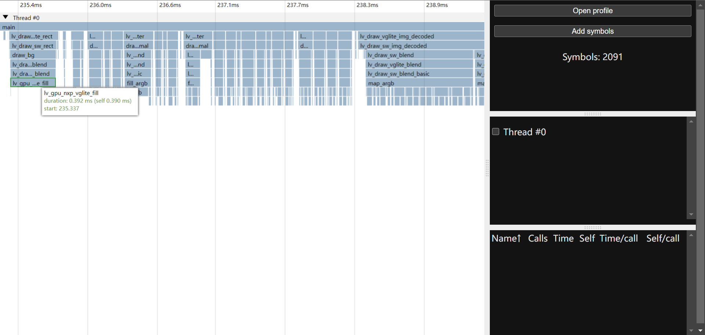

# tiny-prof

> 性能优化的第一步是 profiling



## 为什么不用 gprof ?

1. 不支持多线程
1. 没有好看的界面
1. K230 rt-smart 工具链不支持 gprof
1. 线程挂起时不记录
1. 对动态库支持不好

## 原理

GCC 使用 `-finstrument-functions` 可以对源码进行函数级打桩，在每个函数的开始前调用 `__cyg_profile_func_enter()`，返回前调用 `__cyg_profile_func_exit()`，只要编写这两个函数就可以记录被打桩函数的运行时间。

## 使用方法

1. 编译 `hook.c` 到 `hook.o`，可以使用 `-O3` 优化
1. 编译自己的代码，添加 `-finstrument-functions` 参数，建议添加 `-g` 生成调试符号，避免在最后只能看到一堆函数指针
1. 链接可执行程序时把 `hook.o` 一起链接进去
1. 运行程序，如果在开始时打印了 `start profiling...` 则表示 tiny-prof 成功添加到程序中，程序正常退出时会打印 `end profiling, xxx records, checkout a.profile`，xxx表示记录的函数调用次数，同时生成 `a.profile` 文件
1. 打开 [tiny-prof-viewer](https://mrthanlon.github.io/tiny-prof/)，或者从 GitHub Actions 的 Artifacts 中下载HTML文件部署到你自己的HTTP服务器中
1. 点击右侧的 `Add symbols` 选择运行的可执行 ELF 文件，添加完成后下方的 Symbols 会显示加载了多少个符号
1. 点击右侧的 `Open profile` 选择生成的 `a.profile` 文件，等待查看器加载

### 一些建议

一般来说，火焰图中的大平顶表示这个函数执行的时间比较多，比如存在一个耗时较长的循环，这样的函数可以重点优化，而火焰图中的尖峰通常表示这里的函数调用较为密集，能够优化的空间可能较小。

## 示例

项目自带了两个示例，`test` 和 `test_cpp`，均为多线程，直接 `make` 即可编译，运行后都会生成 profile 文件

## 记录格式

`a.profile` 为二进制文件，字段可以参考下表

| 字段 | 长度 | 值 | 说明 |
|---|---|---|---|
| 文件头 | 4 | 0x9982 | 也用于检测机器是大端还是小端 |
| 指针长度 | 2 | 4 或 8 | 用于检测函数指针长度 |
| pthread_t 长度 | 2 | N/A | |
| traceBegin 函数地址 | 指针长度 | N/A | |
| 线程记录块 | 见下 | | 见下 |

在线程记录块字段中包含多个线程记录块，每一块的结构如下

| 字段 | 长度 | 值 | 说明 |
|---|---|---|---|
| pthread_t | pthread_t 长度 | 取决于线程 | |
| 记录数 | 8 | N/A | 当前块记录的数量 |
| 记录 | 记录数 * sizeof(call_info) | N/A | 每个 `call_info` 记录了一次入栈或出栈的时间和函数地址，时间为64位，单位为微秒，时间最高位为1表示入栈，0表示出栈 |

更详细的细节可以参考 `hook.c` 中的生成代码，或者 `tiny-prof-viewer/src/utils/parse.js` 中的解析代码。

## Roadmap

- [x] Statistics infomation
- [ ] Hide unselected threads
- [ ] Shared library symbols
- [ ] Optimize flame chart performance
- [ ] Color

## FAQ

### 如何加载新的 Profile 文件？

刷新页面。

### 为什么只有函数地址没有函数名？

先点击 `Add symbols` 再点击 `Open profile`，顺序不能错。

### 如何记录标准库的函数调用？

手动给函数调用添加 `__cyg_profile_func_enter()` 和 `__cyg_profile_func_exit()`，例如想要记录 `printf` 的调用情况，但 `printf` 是库函数不会被插桩，那就只能我们手动插了，如下

```c
int main(void) {
    __cyg_profile_func_enter(printf, main);
    printf("Hello World\n");
    __cyg_profile_func_exit(printf, main);
}
```

### `tiny_prof_record` 是什么？我没有调用这个函数呀？

这是 tiny-prof 用来将内存中的记录写入到文件的函数，所以是的，这会对性能产生影响，就如量子力学中的测不准原理一样，性能分析也存在时间不准的情况，函数调用越是频繁这种误差就会越大。

### tiny-prof 对性能有哪些影响？

主要是记录函数调用，具体代码参见 `hook.c`，一次调用会记录32字节的数据（`2*sizeof(struct call_info)`，进入和退出分别16字节），默认的记录缓冲区大小为每个线程32768条记录，也就是512KB，可以修改 `hook.c` 中的 `PROF_RECORD_LENGTH` 宏来自定义大小，或者直接在编译时使用 `-DPROF_RECORD_LENGTH=xxx` 指定，当写满缓冲区时会写入文件进行记录，也就是 `tiny_prof_record` 这个函数，当然也可以手动调用这个函数来清空记录缓冲区。
